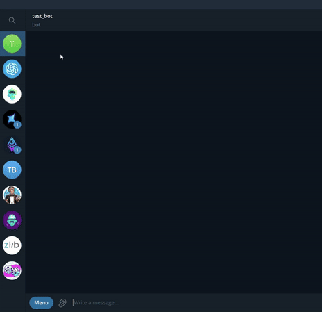

# CS2 Skins Telegram Bot

## Table of Contents

- [About the Project](#about-the-project)
- [Features](#features)
- [Tech Stack](#tech-stack)
- [Usage](#usage)
- [Installation](#installation)
- [Roadmap](#roadmap)
- [Contributing](#contributing)
- [License](#license)
- [Contact](#contact)

## About the Project

This Telegram bot allows users to explore and purchase CS2 skins. It acts like a stock screener, displaying various skins with detailed information and facilitating purchases through connected payment systems (Sber and PayMaster). Currently, the bot serves as a template with a layout that focuses on the user-side experience, without direct integration with Steam for adding skins to the inventory.



## Features

- **Shop Catalog:** Browse skins by categories such as Knives, Rifles, and Pistols.
- **Category Pages:** Each category features subcategories, such as different weapons or types.
- **Product Pages:** See detailed views of each skin, including images, prices, and conditions (Factory New, Minimal Wear, etc.).
- **Purchase Functionality:** Users can buy skins with connected payment systems (currently in test mode).
- **Price Updates:** Skin prices and images are updated using the [cs.money internal API](https://wiki.cs.money/api/graphql).
- **Currency Rates:** Prices are displayed in real-time using exchange rates from [Amdoren's public API](https://www.amdoren.com/api/).

## Tech Stack

- **Language:** Python 3.12
- **Libraries:** Aiogram 3, SQLAlchemy 2, Alembic
- **Database:** PostgreSQL
- **Caching:** Redis
- **Deployment:** Docker

## Usage

To start interacting with the bot, open Telegram and send the command /start to the [@lol_servera_dorogiye](http://t.me/my_bot).

## Installation

### Installation with Docker

1. **Clone the repository:**
   ```bash
   git clone https://github.com/examplefirstaccount/skin_tg_bot.git
   cd skin_tg_bot
   ```

2. **Configure Environment Variables:**

   Create a `.env` file in the root directory and provide necessary values:
   ```.env
   token = <your_tg_bot_api_token>
   sber_token = <your_sber_token> # Use provided test token for testing purposes.
   paymaster_token = <your_paymaster_token> # Use provided test token for testing purposes.
   currency_api_key = <your_currency_api_key> # You can use the provided one or get your own from https://www.amdoren.com/api/.
   pg_host = postgres
   pg_user = postgres
   pg_password = <your_password>
   pg_db = skinTgBot
   redis_host = redis
   redis_db = 0 # Change this if you have Redis image and index 0 is already taken.
   ```

   Tokens for testing:
   ```.env
   sber_token = 401643678:TEST:c14f2f5b-c4f8-4186-bb79-ebcfdf2fb203
   paymaster_token = 1744374395:TEST:32c72e415b20ea2bcafd
   currency_api_key = Y7Q2y92vL7xLSKGwdyiVW85sr9N2dh
   ```

3. **Build and Run the Application:**

   ```bash
   docker-compose up -d --build
   ```

### Installation without Docker
> **Note: This method requires additional software installations and configuration steps and is generally more complex.**

1. **Prerequisites:**
   - Install Python 3.12 
   - Install Poetry 
   - Install PostgreSQL 
   - Install Redis (Redis is not natively available for Windows; consider using WSL or a Redis service)

2. **Clone the repository:**
   ```bash
   git clone https://github.com/examplefirstaccount/skin_tg_bot.git
   cd skin_tg_bot
   ```

3. **Configure Environment Variables:**
   Create a `.env` file in the root directory with the necessary variables as shown above.

4. **Install Dependencies:**
   ```bash
   poetry install
   ```

5. **Set up the Database:**
   - Create a PostgreSQL database and user according to your `.env` file settings.
   - Initialize the Database:
   ```bash
   psql -U postgres -h localhost -d skinTgBot -f database/init_db.sql
   ```

6. **Start Redis Server:**
   ```bash
   sudo service redis-server start
   ```

7. **Run the Bot:**
   ```bash
   poetry run python bot/main.py
   ```

## Roadmap

- [ ] Improve skin images for the slider.
- [ ] Implement shopping cart functionality.
- [ ] Add inline mode for quick skin finding.
- [ ] Add user profile and settings.
- [ ] Implement admin/moderator mode for assisting users.

## Contributing

Contributions are welcome! Please fork the repo and submit a pull request. For major changes, please open an issue first to discuss what you would like to change.

### Steps to Contribute

1. Fork the Project.
2. Create your feature branch (`git checkout -b feature/NewFeature`).
3. Commit your changes (`git commit -m 'Add some NewFeature'`).
4. Push to the branch (`git push origin feature/NewFeature`).
5. Open a Pull Request.

## License

Distributed under the MIT License. See `LICENSE.txt` for more information.

## Contact

Mail: [anr2024@gmail.com](mailto:anr2024@gmail.com)

Project Link: [https://github.com/examplefirstaccount/skin_tg_bot](https://github.com/examplefirstaccount/skin_tg_bot)

---

# Useful commands

```bash
pg_dump -U postgres -h localhost -d skinTgBot -F c -f backup.dump
docker cp backup.dump your_container_name:/backup.dump
docker exec -it your_container_name bash
pg_restore -U your_pg_user -d your_pg_db -F c /backup.dump  # or pg_restore -U myUser -d skinTgBot -F c --no-owner --role=your_user backup.dump
```

# Useful Links

### Aiogram
- https://www.youtube.com/playlist?list=PLN0sMOjX-lm5BMwTm-llmJuA50umZJOsL - video guide for aiogram 3.0
- https://mastergroosha.github.io/aiogram-3-guide/ - text guide for aiogram 3.0
- https://github.com/MasterGroosha/aiogram-and-sqlalchemy-demo/tree/master/bot/
- https://github.com/MassonNN/masson-aiogram-template

### Redis
- https://blog.logrocket.com/guide-to-fully-understanding-redis/
- https://www.tutorialspoint.com/redis/redis_quick_guide.htm

### SQLAlchemy
- https://www.youtube.com/watch?v=hkvngd_BUrY

### Skin images
https://cdn.csgoskins.gg/public/videos/floats/v1/embedding/galil-ar-orange-ddpat.webm - Perfect images for skin bot, but hard to parse (no exteriors, just Factory new)
